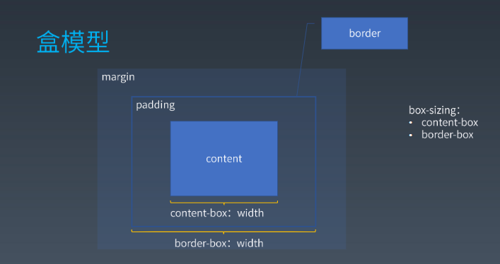

# Css总体结构
 > [css2.1标准](https://www.w3.org/TR/2011/REC-CSS2-20110607/#minitoc)
 > [css3](https://www.w3.org/TR/css-syntax-3/)
* @charset
* @import
* rules
  * @media
  * @page
  * rule

# 排版
## 盒（box） 
* 源代码  标签  Tag
* 语义  元素  Element
* 表现  盒  Box

### 盒模型


content padding border margin

box-sizing: content-box|border-box

content-box: width 不包含padding border
border-box: width 包含padding 和 border

### 正常流


> IFC：inline formatting context 行内格式化上下文

> BFC：block formatting context  块级格式化上下文

### float 和 clean

### margin 折叠


## 作业
div div.hello#myid.div1.divone{
      flex: 1;
      background-color: rgb(233,17,17);
      height: 250px
    }

  匹配选择器 作业在week07中

  ```js
  function match(element, selector) {
      //div.divone#myid.div1
  // 复合选择器判断
  // selector.split('#')[0] 有其他选择器  后面存在.
  // selector.splie('.')[0] 有其他选择器 length > 3  或者  后面存在#
  // /^\w+[.#]/.test(selector) 选择符前面存在标签选择器
  // selector.match(/\w*[.#]\w+(.*)/)  后面是否存在选择器

  if (/^\w+[.#]/.test(selector) || (selector.match(/\w*[.#]\w+(.*)/) && selector.match(/\w*[.#]\w+(.*)/)[1])) {
    selector.match(/^(\w*)((?:\.\w+)*)(#\w+)?((?:\.\w+)*)/)
    
    // div #myid [ 'hello', 'div1', 'divone' ]

    let tagSelector = RegExp.$1
    let idSelector = RegExp.$3
    let classSelector = RegExp.$2.concat(RegExp.$4).split('.')
    classSelector.shift()

    if (tagSelector && element.tagName !== tagSelector) {
      return false
    }

    if (idSelector) {
      let attr = element.attributes.filter(attr => attr.name === 'id')[0]
      if (attr && attr.value !== idSelector.replace('#', '')) {
        return false
      }
    }

    if (classSelector.length > 0) {
      let attr = element.attributes.filter(attr => attr.name === 'class')[0]
      let classValues = attr.value.split(' ')
      return classSelector.every(item => classValues.indexOf(item) > -1)
    }
  }
  }
  ```